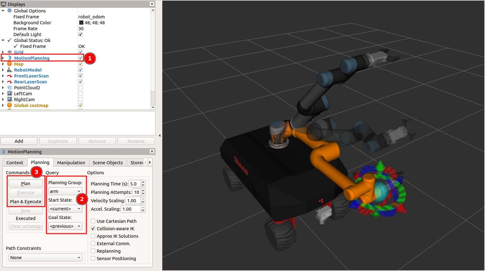
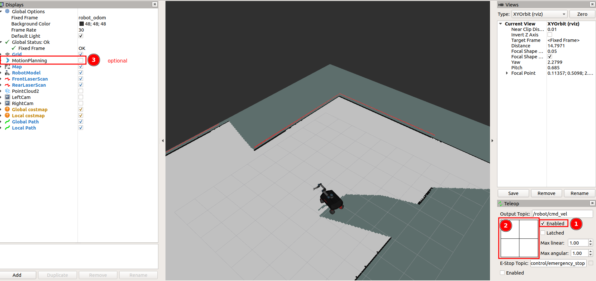

# IROHMS Lab Demos (Robotnik VOGUI). How to Use:

These packages can be installed using [irohms-env](https://github.com/juandhv/tue-env).

## 0. Installing (checking out) rbvogui simulation tests

Before installing any new package, update your installed packages:

```
irohms-get update
```

#### (OPTIONAL) To check out updated dependencies from Robotnik, run the following in a Python3 environment:

```bash
pip install -r https://raw.githubusercontent.com/samuelsont/irohms_robots_tests/main/tests_rbvogui/helper/requirements.txt
python <(wget -O - https://raw.githubusercontent.com/samuelsont/irohms_robots_tests/main/tests_rbvogui/helper/pre_install.py)
```
To roll back the changes to the targets folder:

```bash
cd $IROHMS_ENV_TARGETS_DIR/ && git reset --hard
```

#### To install (check out) the Vogui+ tests in simulation:

```
irohms-get install ros-test_rbvogui_simulation_bringup 
irohms-get install ros-rbvogui_common
```

To build the new packages:

```
irohms-make
```

Source updated setup files:
```
source ~/.bashrc
```

## 1. MoveIt! tests:

To test the basic MoveIt! functionalities with VOGUI+, you should run the following in separate terminals:

```bash
test-rbvogui-simulation-full moveit:=true
```

To start RViz and teleoperate the base:

```bash
test-rbvogui-desktop-rviz rviz_config:=moveit
```

Wait until the robot has put its arm up.

## 1.1 Using RViz visuals:

Once the simulation is running, check and activate the `MotionPlanning` display at the left of RViz, if not activated. Use the visuals in RViz to move the arms to a desired position or select preset poses using the start state and goal state dropdowns.

<p align="center">
  
</p>

Afterwards use the `Plan` and `Execute` buttons to move the VOGUI+'s arms.

## 1.2 Using a script

Run the following command:

```bash
ROS_NAMESPACE=robot rosrun test_rbvogui_common_bringup rbvogui_moveit_demo.py
```

## 2. Mapping tests:

To test the basic `gmapping` functionalities with VOGUI+, you should run in separate terminals:

To start the VOGUI+ in simulation (Gazebo):

```bash
test-rbvogui-simulation-full mapping:=true
```

To start RViz and teleoperate the base:

```bash
test-rbvogui-desktop-rviz rviz_config:=map
```

Start moving the robot around using the teleop panel in Rviz and the map will start appearing in the RViz window.
Ensure that the `MotionPlanning` display is disabled since we are interested in mapping the scene.

<p align="center">
  
</p>

Once all the mapping procedure is finished or it is desired to save the map, open a new terminal in a specific directory and run the following command without closing the simulation:

```bash
ROS_NAMESPACE=robot rosrun map_server map_saver -f {map_name}
```

> Note: `{map_name}` should be replaced. This will save two files, a `.pgm` and a `.yaml`, both are needed so that the map can be used afterwards.

## 3. Localization tests:

To test the basic `amcl` functionalities with VOGUI+, you should run in separate terminals:

To start the VOGUI+ in simulation (Gazebo):

```bash
test-rbvogui-simulation-full localization:=true x_pose:=3 y_pose:=1
```

> Note: To really test localization, spawn the robot in different locations by changing `x_pose` and `y_pose` parameters. To provide a custom map include the `map_file:={map_file_location}` parameter.

To start RViz and teleoperate the base:

```bash
test-rbvogui-desktop-rviz rviz_config:=map
```

Once the simulation is running completely, use the `2D Pose Estimate` tool located in the upper part of RViz and mark the estimated position of the robot using gazebo simulation as a reference.

Then start moving the robot around using the teleop panel, eventually you will see the red particles around the robot converging to a single point in RViz meaning it has localized successfully.

## 4. Navigation tests:

To test the basic `move_base` functionalities with VOGUI+, you should run in separate terminals:

To start the VOGUI+ in simulation (Gazebo):

```bash
test-rbvogui-simulation-full localization:=true navigation:=true
```

> Note: For navigation, localization is required. To provide a custom map include the `map_file:={map_file_location}` parameter.

To start RViz and teleoperate the base:

```bash
test-rbvogui-desktop-rviz rviz_config:=map
```


Use the `2D Nav Goal` tool in the upper side of RViz and set a goal for the robot, it should start moving towards the goal. It is also possible to localize the robot simply by defining goals.

